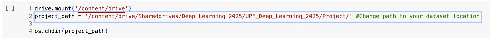

# Energy Consumption Forecasting with LSTM Models

This implementation presents a deep learning solution for predicting household electricity consumption patterns using Long Short-Term Memory (LSTM) networks. The primary objective is to forecast future power consumption values based on historical usage data, helping to anticipate energy demands at the household level. By analyzing temporal sequences of power-related features including global active power, reactive power, voltage, and current intensity, the model learns to recognize and predict consumption patterns across different time periods. This predictive capability has practical applications in smart home energy management, helping households optimize their energy usage and potentially reduce costs.
The focus here is to:
- Train and run a predictive model using a sequence-to-sequence architecture with LSTM neural networks to forecast household electricity consumption.
- Iteratively enhance the basic LSTM architecture through various optimization strategies to maximize prediction accuracy.
- Exploration of advanced features in the model design, such as stateful LSTM layers and time series cross-validation, to improve upon the basic implementation and achieve more robust predictions.

---

## How to Run the Code

To execute the notebooks in Google Colab, follow these steps:

### 1. Download the required datasets:

- For **data exploration** (`DL_FinalProject (Data Exploration).ipynb`): https://drive.google.com/file/d/1R_uc61ZjjMpuh-P66vg0fQUTdIT2wivj/view?usp=share_link 
  [Download the original dataset](#) → Save it to your Google Drive → Update the file path in the notebook where indicated (see image).

- For **baseline and modeling notebooks** (`DL_FinalProject (Baseline).ipynb`, `DL_FinalProject (First/Segond/Third Approach).ipynb`): https://drive.google.com/file/d/1l2O4sL_XOvnuF8fGpJGZU6ZqDKo_X-LV/view?usp=sharing
  [Download the preprocessed dataset](#) → Save it to your Google Drive → Update the file path in the notebooks accordingly (see image).

### 2. Run the notebooks in Google Colab:

Once the datasets are in place and the file paths are updated, simply open the notebooks in [Google Colab](https://colab.research.google.com/) and run all cells. No additional setup is required.

---

**P103 - Team L**

*   Adrià Soria - 251729
*   Judit Viladecans - 251437
*   Paula Ceprián - 252503

---

📌 _Note: This project uses Google Drive integration for data loading. Make sure your dataset is properly uploaded and accessible within the notebook environment._

